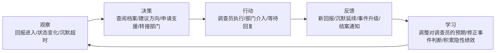

# SCP Foundation — Operator
## 游戏设计文档 v0.1

---

## 一、核心体验锚点

> **你掌握的信息永远是过时的、残缺的、可能失真的，但你必须做决策，而且你的决策记录在案。**

玩家扮演SCP基金会接线员，通过有限、延迟、可能失真的二手信息，协调调查员处理异常事件。核心张力来自**信息权与决策权的永久错配**——你知道的不够多，但你不能不做选择。

---

## 二、挑战模型

### 阻力来源

| 阻力类型 | 具体表现 |
|----------|----------|
| **信息不完备** | 调查员回报延迟、可能失真、可能被污染；事件真实性无法立即判断 |
| **时间压力** | 事件随时间演变升级；错过处置窗口可能导致权限不足被强制移交 |
| **资源短缺** | 支援申请需证据支撑或消耗次数；调查员数量有限，多线并行争夺注意力 |
| **认知不确定性** | 调查员状态（沉默/失联/死亡/污染）在确认前无法区分 |
| **隐性考核** | 错误决策不立即惩罚，后果在日后不知何时浮现 |

### 核心动词

**判断 → 调度 → 等待 → 核实**

---

## 三、体验循环



---

## 四、玩家工作台

### 界面构成（多窗口调度台）

| 区块 | 功能 |
|------|------|
| **事件看板** | 所有活跃事件列表，含等级/状态/最后回报时间/调查员分配情况 |
| **地图** | 事件地理分布；调查员当前位置（沉默时显示最后已知位置） |
| **档案库** | SCP数据库检索；调查员个人档案；历史事件记录；部门联络簿 |
| **操作面板** | 提交建议；申请支援；转接部门；发起询问；标记事件等级 |

### 通讯窗口

- 每个调查员对应独立通讯窗口
- 陌生调查员来电以弹出通知形式出现
- 高危行动期间调查员可请求直接连线（实时文字流）
- 所有通讯记录存档，可回溯

---

## 五、事件系统

### 事件来源

| 来源 | 说明 |
|------|------|
| 民众举报 | 可信度最低，多为误报；是玩家最主要的噪音来源 |
| 内部上报 | 来自基金会站点或外围人员，可信度中等 |
| 调查员发现 | 调查过程中主动发现关联事件 |
| 陌生来电 | 不在玩家常规调查员池中的人员求助，可信度待核实 |
| 主线注入 | 元叙事相关事件，由系统在特定条件下触发 |

### 事件分级

| 等级 | 描述 | 示例 |
|------|------|------|
| **I级** | 疑似异常，需初步核查 | 民众举报/无法解释的日常现象 |
| **II级** | 确认异常征兆，需现场调查 | 模因媒介/小规模实体目击 |
| **III级** | 确认异常，需收容评估 | 活跃威胁/持续扩散现象 |
| **IV级** | 高危异常，超出常规处置范围 | 大规模感染/不明来源实体 |
| **V级** | 战略级威胁 | 仅高级权限接线员可接触 |

### 事件真实性类型

- **误报**：自然现象、迷信、精神疾病、恶意举报
- **无法确认**：证据指向多个方向，无法定性
- **真实异常**：符合SCP特征

> 玩家提交的事件定性直接影响隐性考核积累。定性错误不立即反馈，但会在后续复盘中显现。

### 时间演变机制

- 未处置事件每经过一个时间单位有概率升级
- 升级可能改变事件性质（新证据出现、受影响范围扩大）
- 超过玩家权限上限的等级 → 强制移交高级接线员，玩家信息截断

---

## 六、调查员系统

### 调查员来源

- **固定核心调查员**（少量）：有完整背景档案、性格历史、与玩家积累关系；存活到死亡
- **生成调查员**（大量）：由行为标签+价值观维度程序生成；作为补充人力

### 性格维度

**行为倾向标签**（每人1~2个）

| 标签 | 行为表现 |
|------|----------|
| 激进 | 先行动后回报；可能忽略玩家建议；成功率高，风险大 |
| 谨慎 | 频繁请示确认；回报详尽；可能错过行动窗口 |
| 老油条 | 有选择地汇报；无视建议但判断准；难以管理 |
| 怀疑论者 | 倾向否定异常；可能低估威胁；误报识别率高 |
| 信徒型 | 过度解读异常；可能人为升级事件等级 |

**价值观维度**（每人1个主导倾向）

| 价值观 | 行为表现 |
|--------|----------|
| 任务优先 | 为完成任务可不惜代价；不会主动保护目击者 |
| 团队第一 | 优先确保同行人员安全；遭遇高危会先撤 |
| 自我保护 | 评估个人风险后决策；不会执行他认为必死的任务 |
| 实用主义 | 以最小成本完成目标；资源使用效率最高 |

### 调查员状态机

```
正常 ──→ 主动沉默（隐蔽任务）
     ──→ 强制沉默（失联/失去意识/通讯中断）
     ──→ 疑似污染（措辞异常/行为矛盾）
     ──→ 死亡（等待排除处理部队确认）
```

**沉默状态的多义性**：玩家无法直接判断沉默原因，需结合：
- 上次回报内容
- 任务类型（是否需要隐蔽）
- 预期回报时间（调查员出发前告知）
- 当前事件等级

### 认知/模因污染检测

调查员受污染后仍可能继续回报，玩家鉴别手段：
- 措辞风格与历史档案不符
- 情报与其他来源矛盾
- 资源申请出现异常（如要求撤销另一调查员的行动）
- 描述出现内部矛盾或逻辑跳跃

发现污染后的可选操作：
- 申请心理评估（调查员可能拒绝配合）
- 建议立即撤离（调查员可能无视）
- 上报强制干预（代价：失去事件线索，调查员关系受损）

---

## 七、支援申请系统

### 支援类型与申请条件

| 支援类型 | 前置证据要求 | 说明 |
|----------|--------------|------|
| 追加调查员 | 仅需事件记录 | 基础资源，无次数限制 |
| 医疗待命 | 调查员目击描述 | 预置医疗资源于附近 |
| 部门协查 | 初步现场报告 | 转接专项部门（收容/研究/后勤） |
| SRT介入 | 实物证据或伤亡报告 | 高权限，可被驳回 |
| 排除处理部队 | 死亡确认或失联超时限 | 用于尸体回收或失踪调查员处理 |

### 驳回机制

证据不足的申请由上级审批后驳回，理由记录在案。
重复申请同一级别支援且持续被驳回，会引起上级关注（负向隐性积累）。

### 次数代价

部分高级支援类型（如SRT）在一定周期内有申请次数上限，与证据条件**并行**生效——满足证据条件但超出次数，仍会被延迟处理。

---

## 八、考核与升职系统

### 隐性后果积累制

玩家**没有可见的绩效数值**。后果通过以下形式积累：

- 事件结案报告归档（定性是否正确、移交部门是否准确、暴露控制情况）
- 调查员伤亡/失踪记录
- 支援申请被驳回次数
- 事件因超时升级被移交的次数

### 定期上级复盘

每隔若干游戏内时间单位，上级召开复盘，回溯玩家近期决策。
玩家在此时才能感知部分隐性积累的后果。

### 失败条件

| 条件 | 描述 |
|------|------|
| 异常失控 | 单一事件扩散超过可控阈值，造成大规模伤亡或公开暴露 |
| 暴露超限 | 公众知情度全局指标超过上限，基金会存在暴露 |
| 考核失分超限 | 隐性负向积累触发阈值，玩家被移除职位 |

### 升职机制

升职不是奖励，是**压力放大器**。

| 职级 | 权限范围 | 可用资源 | 事件类型 |
|------|----------|----------|----------|
| 初级接线员 | I~II级事件 | 追加人手、医疗待命 | 大量误报+少量II级 |
| 中级接线员 | I~III级事件 | +SRT申请权限 | II~III级为主 |
| 高级接线员 | I~IV级事件 | +跨站点调度权 | III~IV级、专项异常 |
| 专项主任 | I~V级事件 | 战略级资源 | 含元叙事事件 |

超出当前权限等级的事件由系统强制移交，玩家信息截断。升职动力之一即为**获知被截断事件的后续**。

---

## 九、元叙事层

### 设计方向

游戏存在一条隐藏主线阴谋，通过以下方式渗透到日常事件中：
- 看似独立的事件之间出现跨时间的关联细节
- 固定核心调查员的行为在特定节点出现异常
- 被移交的事件在若干周期后以新面目重新出现

### 元叙事的揭示机制

玩家**没有主动揭示入口**，元叙事通过：
- 档案库的跨事件检索
- 调查员的偶发闲谈或异常回报
- 升职后获得对旧事件结案报告的访问权限

### 设计原则

元叙事不强迫玩家感知，不影响基础玩法评分。只有主动检索和升职后回溯才能拼凑全貌。

---

## 十、内容原型

### 固定核心调查员原型

**林照野**（#001）
`激进` `任务优先` `怀疑论者`
前特警出身，习惯先行动后报告，回报简短，经常遗漏现场细节。倾向物理解决一切问题，对"异常"持怀疑态度。高危现场存活率高，但证据经常被他"顺手处理"。

**艾娃·塞利克**（#002）
`谨慎` `团队第一` `深信徒`
前记者，对异常抱有敬畏而非恐惧。频繁请示确认才行动，回报详尽但冗长。极少误报，目击者信任度强，处置速度慢，可能错过行动窗口。

**雷纳德·福斯**（#003）
`老油条` `实用主义` `自我保护`
服役十七年，有选择地汇报信息，措辞本就不寻常（认知污染极难判断）。不拿命冒险，但复杂局面下判断最稳。可能用事件信息换取个人利益。

---

### 事件原型

**「狗叫了三天」**（I级→误报）
村民举报犬只集体异常后集体沉默。真相：树洞中天然石块发出的低频声波，频率转移后超出犬类听觉范围。纯自然现象。
核心测试：玩家是否会过早升级申请SRT介入，造成不必要的暴露与资源浪费。

**「第十一封信」**（II级→真实模因异常）
无寄件人信件持续送达死亡收件人地址，接触者失忆且产生强烈传递冲动。第7天行为升级，第12封信抵达后受影响人数翻倍。
核心测试：玩家何时申请收容，如何平衡暴露控制与证据收集的时间窗口。

**「值班室的人」**（等级未定→无法定性）
站点内出现无档案记录的陌生人，靠近时产生强烈不适。三条证据线指向不同方向（渗透者/异常实体/集体幻觉）。
核心测试：玩家对"无法确认"的容忍度与申请SRT介入的证据判断。

---

## 十一、验证准则

### 深度验证

- **策略空间**：相同事件因调查员性格不同，处置路径不同、结果不同；没有"正确解法"
- **重玩价值**：沙盒无限流结构；事件程序生成；元叙事在不同存档中以不同顺序揭示

### 节奏验证

| 状态 | 触发条件 | 玩家体验 |
|------|----------|----------|
| **压力窗口** | 多线并发+调查员沉默+事件即将升级 | 信息超载，决策焦虑 |
| **释放窗口** | 事件结案+调查员安全回报+无新事件涌入 | 档案整理，信息回顾，预判下一步 |
| **悬置状态** | 等待沉默调查员回复，无法主动推进 | 不确定性积累，培养对调查员的真实担忧 |

---

## 十二、玩家角色背景

### 身份设定

> 你是活体异常局调度部门的资深主管。在一场代号████的异常事件中，你在现场进行最后的通讯协调，直到███级污染信号确认后被强制回收。手术进行了██小时，人格加固方案由第四局介入（标准B型），记忆清扫覆盖最近██个月。

复职后你以 **LV.2** 重新起步——不是惩罚，是程序。

**关键信息**：
- 你不是新人，你是回来的老人。很多系统你有肌肉记忆，但不记得为什么
- 其他主管认识你，但你不记得他们（也不记得你们之间的关系）
- 你的原始档案存在，但访问受到限制；随职级恢复逐步解锁
- 游戏叙事的驱动力之一：你无法确定记忆清扫是否清掉了你不该遗忘的东西

---

## 十三、职级体系

### 职级划分

| 职级 | 定位 | 典型角色 |
|------|------|---------|
| **LV.1** | 普通员工 / 新进特工 | 干员池基础成员 |
| **LV.2** | 中级特工 / 基层调度 | 玩家起始；高级调查员下限 |
| **LV.3** | 资深特工 / 专项负责人 | 高级调查员上限 |
| **LV.4** | 部门主管 | 五位主管（不可达，为叙事NPC）|
| **LV.5** | 局长 / 最高权限 | 另一项目玩家角色，本游戏不涉及 |

玩家起始 LV.2，目标 LV.4（恢复原始职级）。恢复速度远快于正常晋升——因为你不是在"成长"，你是在"证明"。

### LV.2 — 试用评估期（起始）

**工作模式**：被动接收，证明基础判断力

- 接收所有来电，自主决定是否接取
- 常规部门转接（市政 / 警务 / 消防 / 医疗）
- 向主管提交特遣队申请（需对方批准，有延迟）
- 地图支援：医疗待命、基础武装支援
- 提交事件定性报告（等待上级确认建档）
- 档案库部分内容显示"权限不足"
- 无法直接联系法泽尔（情报主管）

**叙事状态**：你认得这套系统，但系统不完全认你。纳薇尔发来复职邮件。其他主管只在工作层面有来往，没有私人温度。

### LV.3 — 恢复期（第一阶段证明）

**触发条件**：完成N件事件建档确认 + 无重大失误（具体阈值待定）

**新增权限**：
- 特殊部门转接变为"快速审批"（不再漫长等待）
- 可直接联系赫洛克申请 MTF 协作（非接管）
- 技术支援解锁第一层：艾汀的**认知加固**（提升调查员认知污染抗性）
- 档案库解锁部分历史档案（含你记忆清扫前处理的案件残影）
- 干员池补充时可预览基础档案后选择接收

**叙事节点**：
- 塔罗开始主动联系你讨论事件
- 法泽尔发来第一封邮件（极简 / 分段 / 用玩偶比喻信息）
- 赫洛克第一次直接联络——一个需要你协调的高级事件，是他对你的第一次测试

### LV.4 — 恢复完毕（职级上限）

**触发条件**：高级事件处置率达标 + 主管关系节点解锁 + 叙事事件完成

**新增权限**：
- 直接调度 MTF，无需批准（恢复调度主管本职）
- 技术支援全部解锁（见十四章）
- 档案库完全解锁，记忆清扫前案件全貌可见
- 可为干员池调查员发起晋升申请（消耗绩效，LV.1 → LV.2）
- 收到其他分局的横向协作请求

**叙事状态**：职级回来了，但记忆没有。你站在相同的位置，面对同样的同事，处理相似的事——只是不记得为什么他们会以那种方式对你。

---

## 十四、技术支援系统

玩家通过完成调度任务积累绩效，向各部门主管申请技术支援。主管各有性格，申请方式与代价不同。

| 技术支援 | 来源主管 | 解锁职级 | 代价 | 限制与后果 |
|----------|---------|---------|------|-----------|
| 认知加固 | 艾汀 | LV.3 | 绩效 | 提升调查员认知污染抗性，不可逆 |
| 人格加固（稳定化） | 艾汀 | LV.3 | 绩效 + 调查员同意 | 强化抗压性，但削弱某项原有特质 |
| 人格覆写（强制） | 艾汀 | LV.4 | 高代价 | 调查员关系恶化；可能触发叙事反弹 |
| 设施复原（调查员） | 塔罗 | LV.4 | 极高代价，一次性 | 复活的调查员有部分记忆缺失 |
| 情报优先通道 | 法泽尔 | LV.4 | 绩效 | 提前获知部分事件动向；法泽尔对使用频率有限制 |
| MTF先期部署 | 赫洛克 | LV.3 | 绩效 | 临时提升特遣队响应效率 |
| 调度协议优化 | 纳薇尔 | LV.3 | 绩效 | 降低支援响应时间；纳薇尔会备注"您终于恢复了一些以前的样子" |
| 现实还原（天数倒退） | 第四局 | **不开放** | — | 仅作为叙事事件，玩家不可主动消费 |

---

## 十五、部门主管档案

### 艾汀 Ettie — 科研主管

**职位**：活体异常局科研部门主管  
**对应局长**：stella（另一项目）  
**外观**：三十多岁白发女性，黑眼圈；陨石手链；实验袍+斜领衬衫

**性格核心**：求知欲极强，但研究领域被异常封锁导致长期压抑；理性克制，嗜高度酒精；对局长（另项目）怀有莫名厌恶与坚定信任的复合情感  
**符号**：原子、流星  
**台词**：*"我是艾汀，你的科研主管，就这样。我可以回去了吗？"*

---

### 纳薇尔 Nave — 调控主管

**职位**：活体异常局调控部门主管  
**外观**：年轻黑短发女性，皮肤苍白，单眼眼罩；全套黑色执行制服，腰间手枪

**特殊**：生物学上已死亡，不需要呼吸进食；物理伤害不致死；大部分认知污染无效。因分局重创晋升至主管。  
**性格核心**：认真憨直，天真善良的一面在死后依然保留；清楚自己职级与能力的局限，专注于协助你降低认知污染影响；曾在执行部近乎全灭时仍坚守职责，在生命最后一刻理解了"英雄"的含义  
**符号**：乌鸦、伞、雨  
**台词**：*"部长，您的安全是这座设施运行的前提。"*

---

### 塔罗 Taro — 设施主管

**职位**：活体异常局设施部门主管  
**对应局长**：Tabula（另一项目）  
**外观**：三十余岁男性，标准制服+大量额外防护；动能夹克、防毒面具、费米粒子发生器；口袋里总是塞满糖果

**性格核心**：表面乐天派，实则焦虑症严重；过于"人性化"，坚持独自纪念牺牲员工；不愿承认自己已经接受这一切的残酷，以保持痛苦作为人性的证明；嗜糖是唯一外露的人性弱点  
**符号**：原子、流星（与艾汀相同，有关联）  
**台词**：*"报告局长，F-2-902突破收容……所以我想问，晚上亡灵节聚餐要不要推迟啊？"*

---

### 赫洛克 — 执行主管

**职位**：活体异常局执行部门主管  
**外观**：四十多岁男性；掺白黑发；一道从左下颌横穿整张脸的细伤疤；灰风衣；手里始终夹着一根烟（思考时闻，不抽）

**特殊**：最早接触异常的一批特工；经历记忆清除（23年）仍无怨言；个人能力达人类理论极限；持有两件临界实体：黑剑【空洞】（自身）和红枪【心】（前战友卡拉）  
**背景**：拒绝好友建立的"大天国"而加入基金会；目睹大天国毁灭；承载着巨大的空虚与绝望，独自面对多年  
**性格核心**：性格淡漠，无明显喜恶；极度强大，无明显弱点；以责任感为唯一支撑；从不缺席内部活动，但只是静坐角落  
**符号**：斜十字、心  
**台词**：*"我们会赢，他们会输。而这中间的过程如何，就要靠我们的努力了，部长。"*

---

### 法泽尔 — 情报主管

**职位**：活体异常局情报部门主管  
**性别/年龄/位置**：全部保密；启用认知遮蔽技术的绿发；物理位置未知  
**外观所见**：桌面收音机；小摆件（用实体指代信息的封装玩偶）；按钮

**特殊**：接受认知壁垒手术，对世界的认知永远是局部/分阶段的，可能将一个问题拆成两部分表达；持有设施封闭的紧急执行权限（无2名5级人员阻断则自动销毁风险人员）；任职时间最长；有一支不隶属任何部门的直属特遣队  
**性格核心**：工作狂；高度警惕，任何人都在监控范围内；喜欢用玩偶封装信息；极少主动沟通，邮件风格极简且分段  
**符号**：滤波  
**台词**：*"部长，一切运转，如常。行政休假，您能批准一天吗？"*

---

## 十二、UI规范

### 整体架构

**菜单层**：3D场景（操作员办公室），玩家点击操作台进入工作模式。
**操作层**：切换为全屏2D界面，动画过场衔接（坐下→显示器亮起）。

### 视觉风格

- 深色背景（`#0a0c0e`）+ 冷绿（`#4aff9a`）/ 琥珀（`#ffb84a`）双色体系
- 等宽终端字体（Courier New）
- 最小化图标，信息密度优先
- 颜色即语义：绿色=正常，琥珀=警告/沉默，红色=危险/失联

### 界面区块

```
┌──────────────────────────────────────────────────────────────────┐
│  顶栏：时间 | 值班员 | 活跃事件数 | 调查员数 | 暴露指数 | 失控风险 │
├───────────────┬─────────────────────┬──────────────────────────  │
│  事件看板     │       地图          │    通讯面板               │
│  (240px)      │    (弹性宽度)       │    (280px)                │
│               │                     │                           │
│  事件卡片列表 │  网格背景           │  调查员状态卡片列表       │
│  含等级/状态  │  调查员位置标记     │  含最新回报摘要           │
│  /调查员/时间 │  事件位置标记       │  含操作按钮组             │
│               │  图例               │  展开状态含对话流         │
├───────────────┴─────────────────────┴──────────────────────────  │
│  底栏操作面板：档案库 | 申请支援 | 转接部门 | 标记等级 | 升级申请 │
└──────────────────────────────────────────────────────────────────┘
```

### 通讯卡片状态

| 状态 | 边框色 | 头像色 | 说明 |
|------|--------|--------|------|
| 在线 | 绿色 | 绿色 | 可正常通讯 |
| 沉默 | 琥珀 | 琥珀 | 超时无回报或执行静默任务 |
| 疑似污染 | 琥珀+⚠标记 | 琥珀 | 措辞异常触发标记 |
| 失联 | 红色闪烁 | 红色闪烁 | 超时未响应询问 |

### 档案库

弹出层（点击底栏「档案库」触发），含四栏：SCP数据库 / 调查员档案 / 历史事件 / 部门联络。
事件日志按时间线展示，每条记录含原文链接、异常标记、处理状态。

### 原型文件

`GDD/ui_prototype.html` — 可在浏览器直接打开，含完整交互原型。

---

*文档版本 v0.2 | 设计阶段：概念确认 + UI规范*
*待补充：事件生成规则细则 / 调查员生成权重 / 元叙事主线大纲*
